 

🩸 About

$ whoami
> TuHiN — developer WELCOME to my Zone!

$ status --verbose
> Specializing & Optimizing BDIX routes for faster local connectivity
> Experites in self-hosted bots & media tools
> 30 repos and counting

$ currently_learning
> Node.js + TypeScript, Python, self-hosted infrastructure & Linux networking

$ open_to
> Open-source collabs around BDIX/network tooling, self-hosted bots & media tools, automation, and useful developer utilities

<h2>❄️ Tech Arsenal</h2>

<h2>⚡ Featured Builds</h2>

A few things from the 21 repos I'm juggling:

<table>
<tr>
<td width="50%"></td>
<td width="50%"></td>
</tr>
<tr>
<td width="50%"></td>
<td width="50%"></td>
</tr>
</table>

<h2>📊 By The Numbers</h2>

<h2>🏆 Profile Highlights</h2>

<h2>🐍 Contribution Grid</h2>

<picture>
  <source media="(prefers-color-scheme: dark)" srcset="https://raw.githubusercontent.com/TuHiN22/TuHiN22/output/github-contribution-grid-snake-dark.svg" />
  <source media="(prefers-color-scheme: light)" srcset="https://raw.githubusercontent.com/TuHiN22/TuHiN22/output/github-contribution-grid-snake.svg" />
  
</picture>

Automatically regenerated by GitHub Actions.

<h2>📡 Connect</h2>

  

⚡ Thanks for stopping by — now go optimize something. ⚡

